# BusinessOS AI — Master Product Specification / PRD

**Version:** 1.0 (Draft for Review)
**Status:** Pre-Development — Product Definition Phase
**Prepared as:** CTO / Product Architect / SaaS Strategist / UX Architect / Engineering Lead perspective

---

## Table of Contents

1. Executive Summary
2. Product Vision
3. Problem Statement
4. Target Users
5. Product Principles
6. Core User Journey
7. Product Architecture Overview
8. Module Specifications
9. AI Agent Architecture
10. BusinessOS Dashboard
11. Website / Storefront (Secondary Layer)
12. Customer-Side Future Extension
13. Database Architecture
14. Technical Architecture
15. Existing Repository Analysis (SMART-BUSSINESS / AgentHub AI)
16. UX Architecture — Screen List
17. Business Workflows
18. Automation System
19. MVP Definition
20. Phased Roadmap
21. Security & Multi-Tenancy
22. Monetization
23. Competitive Positioning
24. Success Metrics
25. Risks
26. Product Boundaries (Is / Is Not)
27. CTO Final Recommendation

---

## 1. Executive Summary

BusinessOS AI is an AI-powered business operating system built for entrepreneurs, small business owners, and MSMEs who currently have to stitch together 10–20 disconnected tools (website builders, CRMs, marketing tools, accounting software, inventory spreadsheets, social media schedulers) just to run a single small business.

BusinessOS AI replaces that fragmented toolchain with **one connected workspace** that takes a person from a raw business idea through setup, branding, product/service definition, online presence, marketing, sales, customer management, operations, and growth — with AI agents doing as much of the manual work as possible.

The **business owner is the primary user.** The product is not a marketplace, not an Amazon clone, and not a generic storefront builder. Those are downstream capabilities that emerge naturally once a business is operating inside BusinessOS — they are explicitly **Phase 7+** concerns, not MVP concerns.

This document defines the full product surface, the AI agent system, the data model, the technical architecture, the relationship to the existing SMART-BUSSINESS/AgentHub AI repository, the MVP, and a phased roadmap. It intentionally avoids any implementation or coding decisions — its purpose is to make the product completely legible before a single line of Milestone 1 code is written.

---

## 2. Product Vision

**Vision statement:**

> "BusinessOS AI helps turn a business idea into a functioning, growing business — with an AI system that plans, builds, and operates alongside the owner."

A first-time founder should be able to arrive with nothing but an idea — *"I want to start a clothing business"* — and be guided, with AI assistance at every step, through:

Idea → Research → Business Planning → Brand Creation → Product/Service Setup → Website/Store → Marketing → Customer Acquisition → Sales → Operations → Analytics → Growth

The product should feel like a **single AI-native operating system for a business**, not a bundle of SaaS tools wearing the same login page. Every screen, module, and agent exists to answer one of three questions for the owner at any moment:

- What is happening in my business right now?
- What should I do next?
- What can AI do for me automatically?

---

## 3. Problem Statement

Small business owners and first-time entrepreneurs face a consistent set of structural problems:

| Problem | Description |
|---|---|
| Tool fragmentation | Website builder + CRM + accounting + social scheduler + inventory sheet + email tool, none of which share data |
| No starting point | People with an idea don't know the sequence of steps to actually launch |
| Manual overhead | Product descriptions, marketing copy, social posts, and admin tasks are all done by hand |
| Weak marketing skill | Most small owners are not trained marketers or copywriters |
| Low technical skill | No ability to build/maintain a website or configure integrations |
| Operational blind spots | No unified view of inventory, orders, customers, and cash in one place |
| No forward guidance | Existing tools report what happened; they rarely say what to do next |
| Cost sensitivity | Cannot justify 6–10 separate SaaS subscriptions on thin margins |
| Automation illiteracy | Owners don't know what *can* be automated, let alone how |

BusinessOS AI's thesis is that **AI agents plus a unified data model** can collapse this fragmented toolchain into a single connected system that actively reduces the owner's manual workload rather than just presenting more dashboards.

---

## 4. Target Users

### 4.1 Primary Persona Segments

| Persona | Description | Core Need |
|---|---|---|
| First-time founder | Has an idea, no business experience | Guided setup, simplified decisions |
| Solo entrepreneur / freelancer | Runs a one-person service or product business | Time savings, automation |
| MSME owner | Small registered business, some existing operations | Digitization, centralization |
| Online seller | Sells via Instagram/WhatsApp/marketplaces already | Structure, inventory, CRM |
| Local business owner | Physical shop, service provider | Simple digital presence, customer tracking |
| Digitizing existing business | Has manual records (Excel, paper) | Migration into structured system |

### 4.2 Common Pain Points

- Doesn't know where to start
- Too many disconnected tools, no shared data
- Manual, repetitive admin work
- Weak or no marketing skills
- Limited technical/design skills
- Inventory and customer records kept informally or not at all
- No financial visibility beyond a bank balance
- No analytics or feedback loop on what's working
- Doesn't know what could be automated
- Doesn't know what to do next at any given stage

---

## 5. Product Principles

1. **One central business workspace** — a single place, not a suite of separately-branded tools.
2. **AI-first** — AI is a first-class participant in the workflow, not a bolt-on chat widget.
3. **Automation-first** — repetitive tasks should default to automated, with human approval where risk exists.
4. **Beginner-friendly** — a user with zero business or technical background should be able to progress.
5. **Modular architecture** — modules can be built, shipped, and even disabled independently.
6. **Data connected across modules** — a product, order, customer, and campaign all reference the same underlying records.
7. **Owner remains in control** — AI recommends and drafts; irreversible or external-facing actions require approval by default.
8. **Reduce repetitive manual work** — every module should measurably remove a task from the owner's plate.
9. **Start small, architect for scale** — MVP is deliberately narrow; the data model and services are not.
10. **Every feature serves the journey** — starting, operating, or growing a business — nothing else earns a place in the product.

---

## 6. Core User Journey

**Step 1 — Sign up.** Owner creates an account.

**Step 2 — Idea capture.** BusinessOS asks: *"What are you trying to build?"*

**Step 3 — Idea description.** Owner describes it in plain language (e.g., "I want to start a women's clothing business").

**Step 4 — AI Business Setup Agent** interprets the idea: category, business model, likely target customer, initial structure.

**Step 5 — Workspace creation.** BusinessOS instantiates an initial Business + BusinessProfile.

**Step 6 — Guided setup.** AI assists with: business model definition, target customer, lightweight market/competitor research, positioning, brand name and identity direction, initial product/service structure, pricing suggestions, and an initial marketing strategy.

**Step 7 — Product/service creation.** Owner adds their first products or services.

**Step 8 — AI content generation.** BusinessOS generates product descriptions, marketing copy, social captions, campaign ideas, and (where supported) images.

**Step 9 — Launch.** Owner activates their business presence (initially: profile + basic public page; later: full storefront).

**Step 10 — Daily operating system.** BusinessOS becomes the day-to-day home base. The dashboard continuously answers: what's happening, what needs attention, what to do next, and what AI can take off the owner's plate.

---

## 7. Product Architecture Overview

Conceptually, BusinessOS is layered:

```
Frontend (Owner-facing App)
        │
API / Application Services Layer
        │
Core Business Services (Products, CRM, Orders, Inventory, Finance, Marketing)
        │
AI Agent Layer (reasoning, tool-calling, retrieval)
        │
Automation / Workflow Engine
        │
Database (multi-tenant, per-Business isolation)
        │
Integrations (payments, social, messaging, storage)
```

Each module is a bounded service area with its own data, but all reference a shared `Business` entity so that AI agents and dashboards can reason across modules (e.g., a marketing agent can see product and order data; a finance view can see order revenue).

---

## 8. Module Specifications

Modules are deliberately **not** all scheduled for V1. Each is tagged with its target phase.

| Module | Purpose | Phase |
|---|---|---|
| A. Business Setup | Idea capture, AI-assisted structuring of a new business | MVP |
| B. Business Profile | Core business record: name, category, description, branding | MVP |
| C. Business Planning | Lightweight plan: goals, target customer, positioning | MVP |
| D. AI Business Advisor | Ongoing guidance agent, "what should I do next" | MVP (basic) |
| E. Product/Service Management | Create, edit, describe products/services | MVP |
| F. Website/Store Builder | Public-facing page/storefront | Phase 7 |
| G. CRM | Customer records, leads, contact history | MVP (basic) |
| H. Sales | Sales recording, pipeline for service businesses | MVP (basic) |
| I. Orders | Order capture and lifecycle | MVP (basic) |
| J. Inventory | Stock tracking, low-stock alerts | Phase 6 |
| K. Marketing | Campaign planning, AI copy generation | Phase 5 (basic in MVP) |
| L. Social Media | Scheduling, publishing, content calendar | Phase 5 |
| M. Finance | Invoicing, transactions, basic bookkeeping | Phase 6 |
| N. Analytics | Cross-module reporting and insights | Phase 2–3 (basic in MVP) |
| O. Automation | Rule-based and AI-triggered workflows | Phase 8 (simple triggers earlier) |
| P. AI Agents | Full agent framework (see Section 9) | Phased, starting MVP |
| Q. Notifications | Alerts, reminders, digest emails | MVP (basic) |
| R. Integrations | Payments, social platforms, messaging | Phased by need |
| S. Customer Support | Owner's support inbox / AI-assisted replies | Phase 5–6 |
| T. Team Management | Multi-user roles per business | Phase 4+ |

---

## 9. AI Agent Architecture

AI agents in BusinessOS are **not chatbots**. Each agent is a reasoning system with defined inputs, tool access, data scope, and an explicit boundary between actions it can take autonomously and actions that require owner approval.

### 9.1 Agent Roster

| # | Agent | Purpose |
|---|---|---|
| 1 | Business Advisor Agent | Ongoing "what should I do next" guidance across the whole business |
| 2 | Business Setup Agent | Interprets a raw idea into an initial business structure |
| 3 | Market Research Agent | Summarizes market/category context and audience signals |
| 4 | Product Research Agent | Suggests product/service structuring, pricing bands |
| 5 | Product Content Agent | Generates descriptions, specs, image prompts |
| 6 | Marketing Agent | Builds campaign concepts and copy |
| 7 | Social Media Agent | Drafts and schedules social content |
| 8 | Sales Agent | Surfaces follow-ups, drafts outreach |
| 9 | CRM Agent | Enriches/deduplicates customer records, flags at-risk customers |
| 10 | Inventory Agent | Flags stock issues, suggests reorder points |
| 11 | Finance Assistant Agent | Drafts invoices, flags anomalies, summarizes cash position |
| 12 | Customer Support Agent | Drafts replies to inbound enquiries |
| 13 | Analytics Agent | Turns raw metrics into plain-language insight |
| 14 | Automation Agent | Proposes and configures automation rules |
| 15 | Growth Advisor Agent | Longer-horizon strategic suggestions |

### 9.2 Agent Definition Template (applies to all agents)

For every agent, the following must be defined before implementation:

- **Purpose** — the single job the agent exists to do
- **Inputs** — what data/context it receives (structured records + user prompt)
- **Outputs** — draft content, recommendation, structured action, or report
- **Data access** — which entities/tables it can read
- **Actions it can perform** — what it's allowed to write/trigger
- **Human approval requirement** — autonomous vs. approval-gated
- **Automation opportunities** — what could later run on a schedule/trigger
- **Example interaction** — a concrete sample exchange

### 9.3 Example: Product Content Agent (fully specified)

- **Purpose:** Generate marketable product descriptions and content drafts from raw product input.
- **Inputs:** Product name, category, attributes, target customer (from BusinessProfile), tone preference.
- **Outputs:** Draft description(s), bullet feature list, suggested title variants, image prompt (if image generation is enabled).
- **Data access:** Read — Product, BusinessProfile. Write — draft fields on Product only.
- **Actions it can perform:** Populate draft fields; it cannot publish without owner confirmation.
- **Human approval:** Required before content is published to any public-facing surface.
- **Automation opportunity:** Auto-draft on product creation; auto-regenerate on request.
- **Example interaction:** Owner adds "Cotton Kurta, Blue, ₹899" → agent returns a description, 3 title options, and 5 bullet points → owner edits and approves.

### 9.4 Approval Model

All agents fall into one of three tiers:

| Tier | Description | Example |
|---|---|---|
| Autonomous | Runs without confirmation, internal-only effect | Drafting content, generating analytics summaries |
| Approval-gated | Drafts an action; owner must confirm before it takes effect | Publishing content, sending customer emails, posting to social |
| Restricted | Never fully autonomous, always requires explicit per-instance approval | Payments-related actions, refunds, data deletion |

---

## 10. BusinessOS Dashboard

The dashboard is the daily home screen and must answer, at a glance:

- How is my business doing?
- What happened today?
- What needs my attention?
- What opportunities exist?
- What should I do next?
- What can AI automate for me?

### 10.1 Dashboard Sections

| Section | Content |
|---|---|
| Business Health Summary | Composite status: revenue trend, order volume, customer growth |
| Today's Activity | New orders, new leads, messages, low-stock flags |
| AI Recommendations | Ranked list of suggested next actions from the Advisor Agent |
| Tasks | Owner and AI-generated task list |
| Revenue & Orders | Rolling revenue chart, order count, average order value |
| Customers | New vs. returning, at-risk customers flagged by CRM Agent |
| Inventory Alerts | Low stock, out-of-stock items (once Inventory module is active) |
| Marketing Performance | Campaign/content performance summary (once Marketing module is active) |
| AI Actions Log | What AI did automatically, and what's pending approval |

---

## 11. Website / Storefront (Secondary Layer)

Once a business is structured inside BusinessOS, the owner should eventually be able to:

- Choose a template
- Apply branding
- Add products/services
- Publish a public page/storefront
- Receive enquiries and orders
- Have those orders and customers flow directly into BusinessOS

This capability is explicitly **secondary** to the core BusinessOS product and is scheduled for **Phase 7**. The MVP focuses entirely on the owner's operating experience, not the public-facing storefront.

---

## 12. Customer-Side Future Extension

**Stage 1 (Phase 7+):** Each BusinessOS business gets its own individual storefront. Customers browse and buy from that single business; orders flow into that business's BusinessOS workspace.

**Stage 2 (Phase 10, long-term):** A BusinessOS Marketplace aggregates multiple businesses so customers can discover and purchase across sellers, while BusinessOS continues to power the operational backend for every participating business.

This sequencing is intentional: BusinessOS must first prove it can run a single business well before it aggregates many businesses into a marketplace.

---

## 13. Database Architecture (Conceptual)

### 13.1 Core Entities

| Entity | Purpose |
|---|---|
| User | Login identity |
| Organization | Top-level tenant (may map 1:1 with Business initially) |
| Business | The business being operated |
| BusinessProfile | Branding, category, description, positioning |
| Product / ProductVariant | Items or services sold |
| Customer | End customer of the business |
| Lead | Pre-customer contact |
| Order / OrderItem | Sales transactions |
| Inventory | Stock levels tied to ProductVariant |
| Supplier | Source of inventory (Phase 6+) |
| Invoice / Transaction | Financial records |
| MarketingCampaign | Campaign definitions and content |
| SocialAccount / SocialPost | Connected social channels and scheduled posts |
| Task | Owner or AI-generated action items |
| Automation | Configured trigger→action rules |
| AIConversation | Chat/interaction history with agents |
| AIAgentRun | Structured log of an agent execution (inputs, outputs, approval state) |
| Notification | In-app/email alerts |
| Website / Storefront | Public-facing presence (Phase 7+) |
| Subscription | Billing plan state |
| TeamMember | Additional users on a Business (Phase 4+) |

### 13.2 Relationship Notes

- `Organization` 1—many `Business` (supports a user eventually running multiple businesses)
- `Business` 1—many `Product`, `Customer`, `Order`, `Task`, `AIAgentRun`, etc. — this is the primary tenancy boundary
- `Order` many—many `Product` via `OrderItem`
- `Product` 1—many `ProductVariant`; `Inventory` keys off `ProductVariant`
- `AIAgentRun` references the entity it acted on (polymorphic reference) plus the agent type and approval status
- `TeamMember` links `User` to `Business` with a role

This model is deliberately conservative for MVP (fewer entities active) but designed so later phases (Inventory, Finance, Automation, Storefront) attach cleanly without re-architecting core tables.

---

## 14. Technical Architecture

### 14.1 Layers

```
Frontend (React + TypeScript, Vite or Next.js)
        │  REST/RPC
API Layer (FastAPI or Node.js — single choice, TBD at Milestone 1)
        │
Business Services (Products, CRM, Orders, Inventory, Finance, Marketing)
        │
AI Agent Layer (LLM provider + tool-calling + retrieval where needed)
        │
Automation Layer (internal workflow engine; n8n only if justified later)
        │
Database (PostgreSQL, via Supabase or equivalent managed Postgres)
        │
Integrations (Payments: Razorpay/Stripe; Social APIs; Object storage)
```

### 14.2 Notes on Each Layer

- **Frontend:** React + TypeScript. Vite for a fast MVP; Next.js only if SSR/SEO becomes a near-term requirement (relevant once storefronts exist).
- **Auth:** Supabase Auth or equivalent — email/password + OAuth, org/business-scoped sessions.
- **Storage:** Supabase Storage or equivalent object storage for product images, generated assets.
- **AI layer:** LLM provider(s) behind an internal agent abstraction; tool-calling for structured actions (create product, draft campaign, etc.); retrieval (RAG) only where business-specific context genuinely requires it (avoid over-engineering this in MVP).
- **Automation:** Start with simple internal trigger→action rules tied to core events (new order, new customer, low stock). Introduce a dedicated workflow engine only once automation needs outgrow simple internal rules.
- **Payments:** Region-dependent — Razorpay for India-first launch, Stripe for broader/global expansion.

This is a recommended reference architecture, not a final lock-in — Milestone 1 should confirm backend language choice based on what's reusable from SMART-BUSSINESS.

---

## 15. Existing Repository Analysis (SMART-BUSSINESS / AgentHub AI)

**Important caveat:** This analysis is based on the description provided (React/Vite/Supabase seller/e-commerce product with authentication, seller dashboard, product management, orders, analytics, AI content generation, image tools, marketing, social media, storefront, and Supabase Edge Functions). No direct repository access was available at the time of writing this document — before Milestone 1 begins, the actual codebase should be reviewed against this mapping to confirm or correct these assumptions.

| Existing Capability (AgentHub AI) | BusinessOS Mapping | Recommendation |
|---|---|---|
| Authentication | Core BusinessOS auth/tenancy | Reuse, extend to Organization/Business model |
| Seller dashboard | BusinessOS Dashboard (Section 10) | Refactor: reframe around "what's happening / what's next," not just seller stats |
| Product management | Product/Service Management module | Reuse core CRUD, extend schema for services (not just physical products) |
| Orders | Orders module | Reuse as a starting point; simplify for MVP, extend later |
| Analytics | Analytics module | Reuse where metrics already exist; reframe as insight-driven, not raw charts |
| AI content generation | Product Content Agent / Marketing Agent | Reuse generation logic; re-architect into the formal agent framework (Section 9) |
| Image tools | Product Content Agent (image prompt/generation path) | Reuse if functional; treat as an agent capability, not a standalone tool |
| Marketing tools | Marketing module | Reuse content generation; defer campaign scheduling to Phase 5 |
| Social media | Social Media module | Defer to Phase 5 — do not prioritize in MVP even if code exists |
| Storefront | Website/Storefront (Section 11) | Explicitly deprioritize to Phase 7 — do not let existing storefront code pull focus into MVP |
| Supabase / Edge Functions | Core infrastructure | Reuse as the default backend/database choice unless Milestone 1 review finds a blocker |

**What should likely be removed or set aside:** any marketplace-style, multi-seller, or public-discovery features from AgentHub AI — these map to Phase 10 (Marketplace), not MVP, and should not shape early schema decisions.

**What is missing and must be newly built:** the Business Setup Agent and idea-to-plan flow (Section 6, Steps 2–6), the CRM module, the unified AI Agent framework with approval tiers (Section 9), and the cross-module dashboard (Section 10) as a "what's next" surface rather than a stats page.

---

## 16. UX Architecture — Screen List

### 16.1 Public

- Landing page
- Pricing page
- Login
- Signup

### 16.2 Onboarding

- Business idea capture
- AI-assisted business setup review
- Business profile confirmation
- Initial AI recommendations review

### 16.3 Core Application

| Screen | Purpose | Key Components |
|---|---|---|
| Dashboard | Daily home view | Health summary, AI recommendations, tasks, alerts |
| Business | Profile, branding, positioning | Editable profile fields, brand assets |
| Products | Manage products/services | List, create/edit form, AI content panel |
| Customers | CRM | Customer list, detail view, notes/history |
| Sales / Orders | Transaction management | Order list, order detail, status pipeline |
| Inventory (Phase 6) | Stock tracking | Stock levels, low-stock alerts |
| Marketing (Phase 5) | Campaigns and content | Campaign list, AI content generator |
| Finance (Phase 6) | Invoicing, transactions | Invoice list, transaction ledger |
| Analytics | Cross-module insight | Charts + plain-language AI summaries |
| AI Agents | Agent interaction hub | Per-agent chat/action history |
| Automations (Phase 8) | Configured rules | Rule list, trigger/action builder |
| Settings | Account, team, billing | Profile, plan, team members, integrations |

### 16.4 Future

- Website/store builder (Phase 7)
- Public storefront (Phase 7)
- Marketplace (Phase 10)

---

## 17. Business Workflows

**New Business Workflow:**
Account created → Business created → Idea described → AI analyzes idea → Business profile drafted → Target audience suggested → Products/services suggested → Initial action plan generated → Owner approves → Workspace activated.

**Product Workflow:**
Product created → Details entered → AI generates content → Product saved → Inventory record created (Phase 6) → Product becomes sellable.

**Sales Workflow:**
Order/customer event occurs → Order created → Inventory updated (Phase 6) → Customer profile updated → Revenue recorded → Dashboard updated → Analytics Agent processes transaction.

**Marketing Workflow:**
Product selected → Marketing Agent generates campaign concept → Owner reviews → Content finalized → Scheduled/published (Phase 5) → Performance data collected → Growth/Marketing agent recommends adjustments.

---

## 18. Automation System

| Trigger | Action | Type |
|---|---|---|
| New order | Update inventory | Automatic |
| New customer | Create CRM record | Automatic |
| Low inventory | Alert owner | Automatic (notification) |
| New product | Draft marketing content | Automatic draft / Approval-gated publish |
| Sales milestone reached | Notify owner | Automatic |
| Customer inactive N days | Suggest follow-up | Approval-gated (owner sends) |
| Daily summary | AI-generated report | Automatic |
| Weekly review | AI recommendations | Automatic |

General rule: **internal, reversible, informational actions are automatic; anything customer-facing, financial, or irreversible requires explicit approval**, consistent with the agent tiering in Section 9.4.

---

## 19. MVP Definition

### 19.1 MVP Must Allow a User To:

1. Sign up
2. Create a business
3. Describe their business idea
4. Receive AI-assisted business setup (profile, target customer, initial positioning)
5. Create products/services (with AI-generated descriptions)
6. Manage basic customer records (CRM-lite)
7. Record basic sales/orders manually
8. View a simple, insight-oriented dashboard
9. Generate basic marketing content (copy only, no scheduling/publishing)
10. Interact with at least one useful AI agent (Business Advisor + Product Content Agent)
11. Track basic business metrics (revenue, order count, customer count)

### 19.2 Why Each Is Necessary

Each MVP item maps directly to removing a specific manual step identified in Section 3 (idea structuring, product copywriting, basic record-keeping) without requiring the operational depth (inventory, finance, automation, storefront) that a first-time user does not yet need to prove the core value proposition.

### 19.3 Explicitly NOT in MVP

- Website/storefront builder
- Public marketplace
- Inventory management
- Finance/invoicing/bookkeeping
- Social media scheduling/publishing
- Automation engine (beyond a couple of hardcoded triggers, e.g., low-stock-style placeholder)
- Team/multi-user roles
- Advanced AI agents (Market Research, Growth Advisor, Automation Agent)
- Payment processing

---

## 20. Phased Roadmap

| Phase | Focus | Key Deliverables |
|---|---|---|
| 0 | Product foundation | Finalized spec (this document), architecture decision, repo audit |
| 1 | Identity + auth | Signup/login, Organization/Business/User model, tenancy boundary |
| 2 | Business setup + AI advisor | Idea capture flow, Business Setup Agent, Business Advisor Agent (basic), Dashboard v1 |
| 3 | Products/services | Product module, Product Content Agent, product list/detail UX |
| 4 | CRM + sales | Customer records, manual order entry, Sales Agent (basic), team roles begin |
| 5 | Marketing + AI agents | Marketing Agent, Social Media module, expanded agent roster |
| 6 | Inventory + finance | Inventory module, Finance module, Finance Assistant Agent |
| 7 | Website/storefront | Template builder, public page, order intake from storefront |
| 8 | Automation | Automation module, Automation Agent, rule builder UX |
| 9 | Advanced AI agents | Analytics Agent, Growth Advisor Agent, cross-agent orchestration |
| 10 | Marketplace/ecosystem | Multi-business discovery layer, shared customer marketplace |

For each phase, the following should be defined at planning time (deliberately not filled in here to avoid premature technical commitment): objective, features, user value, database changes, backend work, frontend work, AI work, testing plan, and definition of done.

---

## 21. Security & Multi-Tenancy

- **Authentication:** managed auth provider (e.g., Supabase Auth), session-scoped to Organization/Business.
- **Tenant isolation:** every core table scoped by `business_id`; enforced at the database layer (row-level security) wherever the underlying database supports it.
- **Role-based access:** Owner, Team Member (Phase 4+), with granular permissions introduced only as Team Management is built.
- **API security:** authenticated, business-scoped endpoints; no cross-tenant data access paths.
- **Secrets management:** environment-based secrets store; no client-side exposure of API keys.
- **Audit logs:** every AI agent action logged via `AIAgentRun` with inputs, outputs, and approval state (Section 9.2).
- **AI permissions:** enforced per the three-tier approval model (Section 9.4) — autonomous, approval-gated, restricted.
- **Human approval for sensitive actions:** required for anything financial, customer-facing, or irreversible.

---

## 22. Monetization

Illustrative tiering — final numbers require market validation, not invented here without caveat:

| Tier | Target User | Illustrative Limits |
|---|---|---|
| Free | Trying the product | 1 business, limited AI actions/month, no storefront |
| Starter | Early solo owner | 1 business, moderate AI usage, basic marketing content |
| Growth | Active small business | Multiple products, CRM, basic automation, higher AI usage |
| Pro | Established MSME | Inventory, finance, storefront, team members |
| Business | Multi-user, higher volume | Full automation, advanced agents, priority support |

Dimensions to gate by: number of businesses, AI actions/month, number of products, number of team members, automation rule count, storefront availability, and advanced agent access. Actual price points should be set after MVP usage data and competitor benchmarking, not fixed in this document.

---

## 23. Competitive Positioning

| Competitor | Their Focus | BusinessOS Difference |
|---|---|---|
| Shopify | E-commerce storefront | BusinessOS starts before the storefront — idea, planning, brand — storefront is a later layer |
| Zoho / Odoo | Broad business software suites | BusinessOS is AI-native and journey-driven, not a menu of disconnected apps under one login |
| HubSpot | CRM/marketing suite | BusinessOS integrates CRM into the full business journey, not as a standalone specialty tool |
| Wix | Website builder | Website is secondary in BusinessOS; the core product is business operations |
| QuickBooks | Accounting | Finance is one module among many, connected to sales/marketing data, not a silo |
| Canva | Content creation | Content generation is agent-driven and data-connected (knows the product/customer), not generic design |
| Zapier | Automation | Automation is embedded and business-context-aware, not a general-purpose integration tool |
| Traditional ERP | Large-org operations | BusinessOS is built for a solo/small owner from day one, not scaled-down enterprise software |

**Core differentiation:** BusinessOS AI is organized around the *business journey* (idea → operating business) with AI-assisted operations throughout, rather than being one specialized tool that the owner must supplement with others.

---

## 24. Success Metrics

**North Star:** *"Help a business owner go from idea to operating business with dramatically less manual work."*

| Metric | What It Tells Us |
|---|---|
| Businesses created | Top-of-funnel interest |
| Businesses activated (first product + first sale/order logged) | Real activation, not just signup |
| Products/services created | Depth of setup |
| Orders processed | Operational usage |
| AI actions completed | AI adoption and reliance |
| Automations executed (Phase 8+) | Automation value realized |
| Monthly active businesses | Retention of the core unit |
| Customer retention (owner's customers, via CRM) | Downstream business health |
| Time saved per business owner (self-reported or estimated) | Core value proposition validation |

---

## 25. Risks

| Risk | Mitigation |
|---|---|
| Scope creep toward marketplace/storefront too early | Enforce phase gating (Section 20); MVP explicitly excludes storefront |
| AI agents taking unsafe autonomous actions | Strict approval tiering (Section 9.4) applied to every agent from day one |
| Reusing SMART-BUSSINESS architecture uncritically | Formal repo audit against this spec before Milestone 1 (Section 15) |
| Over-engineering automation/agent framework before proving core value | MVP uses only Business Advisor + Product Content agents; expand roster per phase |
| Data model rigidity | Conservative MVP entity set (Section 13) designed to extend without core rework |
| Owner distrust of AI-generated content/actions | Default approval-gated tier for anything customer-facing or financial |

---

## 26. Product Boundaries — Is / Is Not

**BusinessOS AI IS:**
- An AI-powered business operating system
- A business launch assistant
- A business management platform
- An automation platform (progressively)
- An AI business assistant
- Future commerce/store infrastructure (later phase)

**BusinessOS AI IS NOT, initially:**
- An Amazon clone
- A public marketplace
- A pure website builder
- A pure CRM
- Pure accounting software
- A pure marketing tool
- A generic AI chatbot

---

## 27. CTO Final Recommendation

1. **Build first:** Identity/tenancy (Phase 1) → Business Setup + AI Advisor (Phase 2) → Products + Content Agent (Phase 3) → basic CRM/Sales (Phase 4). This is the MVP as defined in Section 19.

2. **Do not build yet:** Storefront, marketplace, inventory, finance, automation engine, social scheduling, advanced agents. All deferred per the phased roadmap (Section 20).

3. **Reuse from SMART-BUSSINESS:** Authentication foundation, core product CRUD, existing AI content-generation logic (re-homed into the formal agent framework), and Supabase infrastructure — pending a direct repository audit to confirm code quality and fit.

4. **Architecture:** React/TypeScript frontend (Vite initially), Postgres via Supabase (or equivalent), a single backend language decided at Milestone 1 based on what's reusable, and an internal AI agent abstraction layer from day one rather than ad hoc LLM calls scattered across features.

5. **First real MVP:** Idea capture → AI-assisted business setup → product creation with AI content → basic CRM/orders → insight-driven dashboard, exactly as scoped in Section 19.

6. **Milestone 1:** Identity, tenancy, and the Business/BusinessProfile data model — the foundation everything else depends on.

7. **Milestone 2:** Business Setup Agent + idea-to-plan flow + Business Advisor Agent v1 + Dashboard v1.

8. **Milestone 3:** Product/Service module + Product Content Agent + basic CRM and manual order entry.

9. **AI agent introduction:** Start with exactly two agents (Business Setup, Product Content) inside the formal approval-tiered framework from Section 9 — resist adding more agents until the core loop (idea → product → sale) is proven with real users.

10. **Customer storefront:** Introduce at Phase 7, only after Products, CRM, Sales, Marketing, and Inventory/Finance are stable — the storefront should sit on top of a proven operational core, not precede it.

11. **Marketplace:** Introduce at Phase 10, only after multiple individual storefronts are live and generating real order volume — a marketplace without operationally healthy individual businesses underneath it has nothing to aggregate.

---

---

# PART 2 — VISUAL ARCHITECTURE & IMPLEMENTATION BLUEPRINT

Part 1 defined *what* BusinessOS AI is. Part 2 makes the system's structure, data flow, and interfaces visually explicit — for founders, PMs, engineers, AI engineers, designers, DevOps, and investors alike — and closes with an exact, milestone-by-milestone build order.

---

## 26. Visual Product Architecture — Overview

Every diagram below follows the same conventions:

- **Solid arrows** = direct calls / data flow
- **Grouped boxes** = a logical layer or service boundary
- **Labeled edges** = what data or action moves along that path
- Frontend, backend, AI, and external-integration boundaries are always visually separated

These diagrams are the shared mental model for the whole team — a PM should be able to point at a box and know what it means, and an engineer should be able to point at the same box and know what to build.

---

## 27. Master BusinessOS Architecture

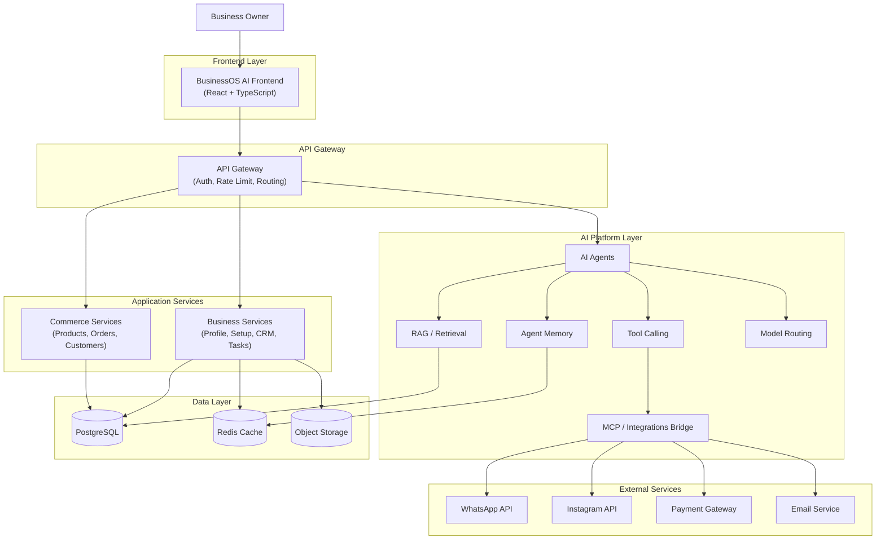

**Layer explanations:**

- **Frontend Layer** — the owner-facing React application; the only layer the user directly touches.
- **API Gateway** — single entry point handling authentication, authorization, rate limiting, and routing to the correct service.
- **Application Services** — the business logic: Business Services (setup, profile, CRM, tasks) and Commerce Services (products, orders, customers). This is where MVP work concentrates.
- **AI Platform Layer** — agents, tool-calling, retrieval, memory, model routing, and the MCP bridge that lets agents call out to integrations safely.
- **Data Layer** — PostgreSQL as the system of record, Redis for cache/session/short-term agent memory, object storage for images and generated assets.
- **External Services** — WhatsApp/Instagram (Phase 5+), payment gateway (Phase 6+), email (MVP, for notifications).

---

## 28. Business Owner Journey Diagram

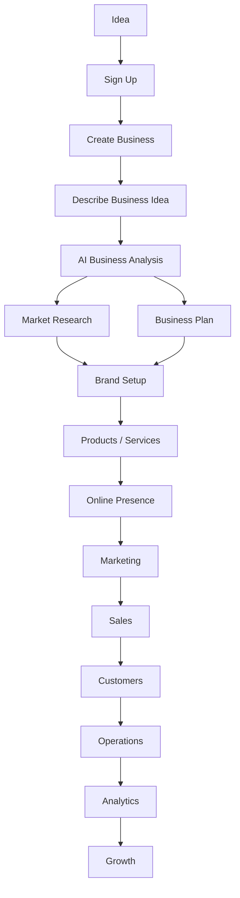

**What BusinessOS does at each stage:**

| Stage | System Behavior |
|---|---|
| Idea | Captures free-text description |
| Sign Up | Creates User + Organization |
| Create Business | Creates Business record, empty BusinessProfile |
| Describe Idea | Business Setup Agent parses category, model, audience signals |
| AI Business Analysis | Produces structured draft: profile, positioning, initial plan |
| Market Research | Market Research Agent adds category/competitor context (Phase 2+) |
| Business Plan | Owner reviews/edits AI-drafted plan and target customer |
| Brand Setup | Name, logo/asset placeholders, tone of voice captured in BusinessProfile |
| Products/Services | Owner adds items; Product Content Agent drafts descriptions |
| Online Presence | Basic public profile page (MVP); full storefront (Phase 7) |
| Marketing | AI-generated copy (MVP); scheduling/publishing (Phase 5) |
| Sales | Manual order entry (MVP); pipeline tracking (Phase 4+) |
| Customers | CRM record creation and history tracking |
| Operations | Inventory, finance visibility (Phase 6) |
| Analytics | Dashboard metrics (MVP); AI-generated insight narratives (Phase 3+) |
| Growth | Growth Advisor Agent surfaces longer-horizon suggestions (Phase 9) |

---

## 29. BusinessOS Core Architecture — Seven Layers

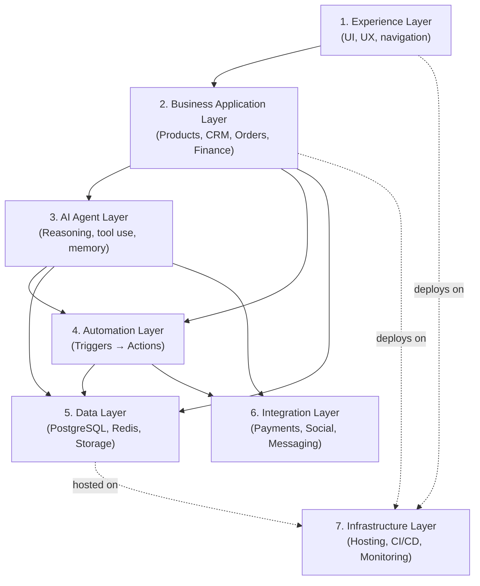

**Communication rules:**

- The Experience Layer never talks to Data or Integration layers directly — everything routes through the Business Application Layer or the AI Agent Layer.
- The AI Agent Layer can read Data Layer records (via services, not direct DB access) and can trigger the Automation Layer.
- The Automation Layer is the only layer permitted to call external Integrations autonomously (under the approval rules in Section 9.4); the AI Agent Layer calls integrations only through the Automation/MCP bridge.
- The Infrastructure Layer underlies everything but has no product logic of its own.

---

## 30. AI Architecture Diagram

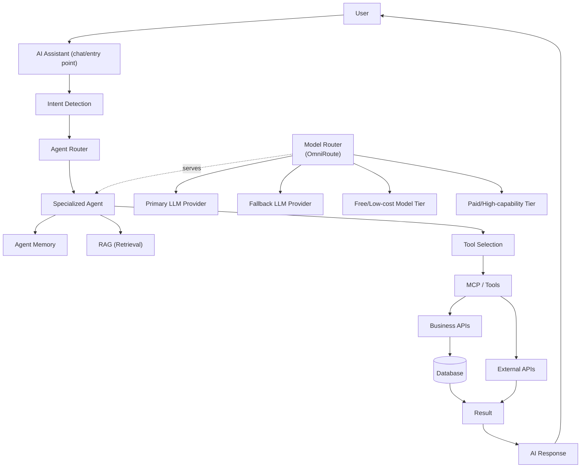

### 30.1 MVP AI Architecture

- User → AI Assistant → **single-purpose call** to one of two agents (Business Setup Agent, Product Content Agent)
- No agent router needed yet — the UI context (which screen the user is on) determines which agent is invoked
- No persistent long-term memory — conversation-scoped context only
- Single LLM provider, no fallback routing
- No RAG — all context passed directly as structured data (Business, Product records)

### 30.2 Future AI Architecture (Phase 5+)

- Full **Intent Detection + Agent Router** across the expanded agent roster (Section 9)
- **Agent memory** persisted per business (recent decisions, preferences, past approvals)
- **RAG** introduced once there is enough business-specific unstructured content (uploaded docs, past campaigns) to justify retrieval
- **Model routing** across multiple providers with fallback and free/paid tiering for cost control
- **Token/context optimization** and prompt management become dedicated internal concerns as agent count grows

**Explicitly:** none of the routing, memory, RAG, or multi-provider complexity is required to ship MVP. Building it prematurely would violate the "start small, architect for scale" principle (Section 5).

---

## 31. AI Agent Map

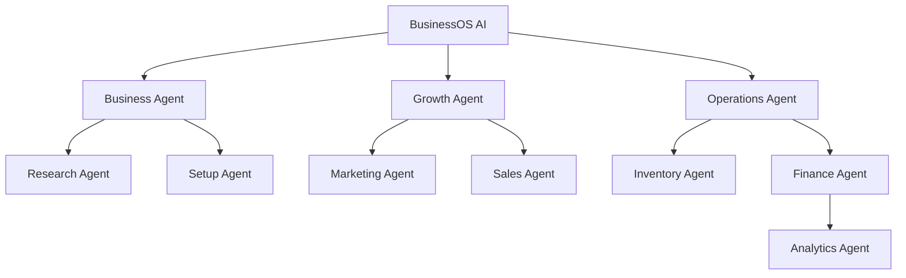

### 31.1 Agent-to-Capability Mapping

| Agent | Tools | Data Access | Permissions | Actions | Human Approval |
|---|---|---|---|---|---|
| Setup Agent | Idea parser, profile writer | BusinessProfile (write draft) | Draft-only | Populate profile fields | Required to activate |
| Research Agent | Category/competitor lookup | BusinessProfile (read) | Read-only + draft notes | Attach research summary | Not required (informational) |
| Product Content Agent | Copy generator, image prompt | Product (read/write draft) | Draft-only | Populate description fields | Required to publish |
| Marketing Agent | Campaign generator | Product, BusinessProfile (read) | Draft-only | Create MarketingCampaign draft | Required to publish/schedule |
| Sales Agent | Follow-up drafter | Customer, Order (read) | Draft-only | Draft outreach message | Required to send |
| Inventory Agent | Stock analyzer | Inventory (read), alerts (write) | Read + alert-write | Create low-stock Notification | Required to trigger reorder |
| Finance Agent | Invoice drafter, anomaly detector | Invoice, Transaction (read/draft) | Draft-only | Draft Invoice | Required to send/finalize |
| Analytics Agent | Metric summarizer | Cross-module read | Read-only | Generate insight text | Not required (informational) |

---

## 32. Data Architecture

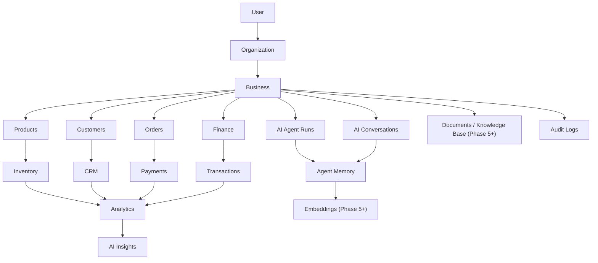

**What belongs where:**

- **Operational data** (Products, Customers, Orders, Finance) is the system of record — always tenant-scoped to `Business`.
- **Analytics** is derived, not authoritative — it's computed from operational data, never a separate source of truth.
- **AI Insights** are generated text/recommendations layered on top of Analytics — stored for history but always regenerable.
- **AI Agent Runs / Conversations / Memory** are AI-specific operational data, tenant-scoped the same way, and feed the Audit Log.
- **Embeddings / Knowledge Base** are Phase 5+ additions once RAG is justified (Section 30.2) — not part of MVP data architecture.
- **Audit Logs** span the whole system and are append-only.

---

## 33. Database ER Diagram

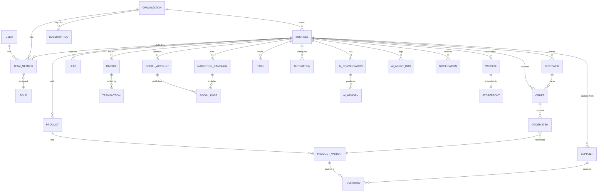

### 33.1 Entity Notes

| Entity | Purpose | Key Fields | Tenant Isolation |
|---|---|---|---|
| USER | Login identity | email, auth_id | Global (not tenant-scoped) |
| ORGANIZATION | Top-level billing/tenant unit | name, plan | Root of isolation tree |
| BUSINESS | The operated business | name, category, org_id | Primary isolation key for all downstream tables |
| TEAM_MEMBER | Links User↔Business with a Role | user_id, business_id, role_id | Scoped to business_id |
| ROLE | Permission set | name, permissions | Global reference table |
| PRODUCT / PRODUCT_VARIANT | Sellable items | name, price, business_id | Scoped to business_id |
| INVENTORY | Stock levels | variant_id, quantity | Scoped via variant → business |
| SUPPLIER | Inventory source | name, business_id | Scoped to business_id |
| CUSTOMER / LEAD | People the business serves | name, contact, business_id | Scoped to business_id |
| ORDER / ORDER_ITEM | Sales transactions | customer_id, total, status | Scoped to business_id |
| INVOICE / TRANSACTION | Financial records | amount, status | Scoped to business_id |
| MARKETING_CAMPAIGN | Campaign content/schedule | name, content, business_id | Scoped to business_id |
| SOCIAL_ACCOUNT / SOCIAL_POST | Connected channels/content | platform, business_id | Scoped to business_id |
| TASK | Owner/AI action items | title, status, business_id | Scoped to business_id |
| AUTOMATION | Trigger→action rules | trigger, action, business_id | Scoped to business_id |
| AI_CONVERSATION / AI_AGENT_RUN | Agent interaction history | agent_type, input, output | Scoped to business_id, feeds Audit |
| AI_MEMORY | Persisted agent context (Phase 5+) | summary, embedding | Scoped to business_id |
| NOTIFICATION | Alerts/reminders | message, read_state | Scoped to business_id |
| SUBSCRIPTION | Billing plan state | plan, status | Scoped to organization_id |
| WEBSITE / STOREFRONT | Public presence (Phase 7+) | template, domain | Scoped to business_id |

---

## 34. Frontend Architecture

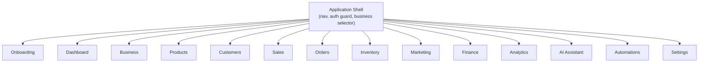

**Routing & component notes:**

- The Application Shell owns authentication guarding, the active-business context, and top-level navigation; every module below it is a routed sub-tree.
- Each module (Products, Customers, Orders, etc.) is a self-contained feature folder: its own routes, list/detail components, and API hooks — enabling modules to be shipped or hidden independently per Principle 5 (modular architecture).
- The **AI Assistant** is not a separate "page" only — it is also embedded contextually inside other modules (e.g., a "Generate description" button inside Products calls the same underlying agent as the standalone Assistant screen).
- Modules not yet built (Inventory, Marketing, Finance, Automations pre-Phase 6/8) are simply absent from the sidebar until their phase ships — no placeholder/"coming soon" screens in MVP.

---

## 35. Backend Architecture

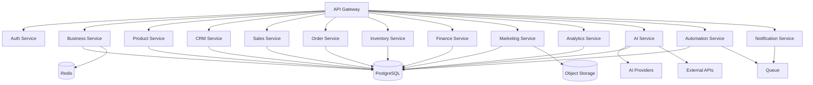

**MVP recommendation — modular monolith:**

For MVP, every "service" box above (Business, Product, CRM, Sales, Order, AI) should be a **module inside a single deployable backend**, not a separately deployed microservice. Reasons:

- A single small team cannot operate 8+ independently deployed services without disproportionate DevOps overhead.
- Tenant-scoped data access patterns (everything keyed by `business_id`) are simpler to enforce consistently inside one codebase.
- Module boundaries are enforced at the **code/package level** (clear internal interfaces), so splitting into real microservices later — if and when a specific module needs independent scaling (most likely the **AI Service**, due to different latency/cost/scaling characteristics) — is a refactor, not a rewrite.

**Explicitly avoid:** standing up separate microservices for Business/Product/CRM/Sales/Order at MVP. This is over-engineering relative to actual load and team size. The **AI Service** is the one component worth keeping architecturally separable early, since LLM calls have fundamentally different latency, cost, and scaling profiles than CRUD operations.

---

## 36. Automation Architecture

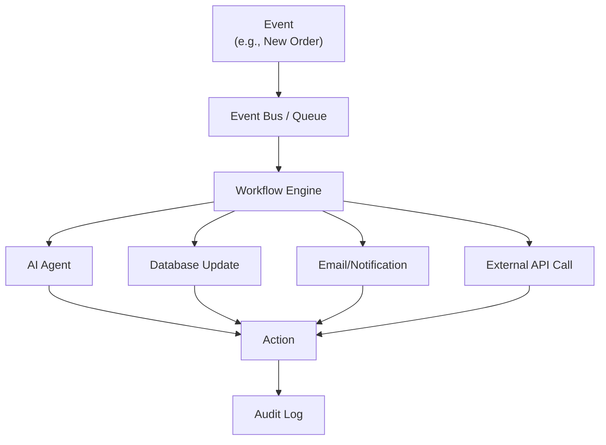

**Worked examples:**

- **New Order:** Order created → Inventory updated → Customer record updated → Revenue recorded → Owner notified → Analytics Agent generates a business insight.
- **Low Inventory:** Threshold detected → Owner notified → Inventory Agent suggests a reorder quantity (approval-gated before any purchase action).
- **New Product:** Description generated (Product Content Agent) → Social content drafted (Phase 5) → Campaign prepared (Phase 5) → Owner approval requested before anything publishes.

Per Section 9.4/18, only the internal, reversible steps (inventory update, record update, internal notification, draft generation) run automatically; anything customer-facing or irreversible pauses for approval.

---

## 37. Complete Product Flow (Master Diagram)

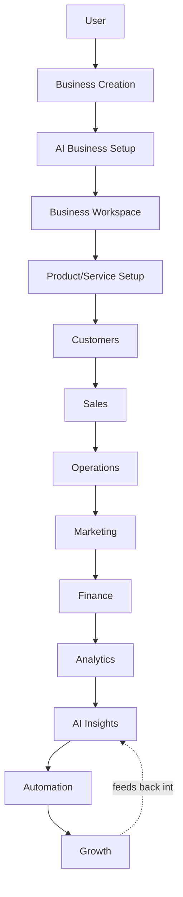

This is the single diagram that should anchor every other conversation about the product — every module and agent in this document exists to serve one segment of this loop.

---

## 38. What We Are Actually Building

Plainly, for an engineer starting tomorrow:

We are building a **multi-tenant SaaS web application**.

A user creates an account. The user creates a business workspace. The user describes their business in plain text. BusinessOS stores this as a business profile record. An AI agent analyzes that description and produces structured recommendations (positioning, target customer, initial plan). The user reviews and edits those recommendations. The user creates product or service records. The platform stores all of this as normal relational data, scoped to that business. The dashboard queries and aggregates that data. AI agents can read business data they've been granted access to, and can call a defined set of tools/actions — never arbitrary ones. Automations are simple trigger→action rules that react to business events (new order, low stock, new product). The business owner can approve or reject any AI-proposed action that is customer-facing, financial, or irreversible. Every AI action, whether autonomous or approved, is logged. Later, the platform provides a public storefront so the business's own customers can browse and order directly, with those orders flowing back into the same workspace.

| Capability | MVP | Phase 2–3 | Future |
|---|---|---|---|
| Account/business creation | ✅ | — | — |
| AI-drafted business setup | ✅ (basic) | Deeper research/positioning | Continuous re-analysis |
| Product/service records + AI content | ✅ | Image generation, variants | Bulk import, catalogs |
| CRM (customer records) | ✅ (basic) | Lead pipeline, notes/history | Segmentation, lifecycle automation |
| Orders | ✅ (manual entry) | Status pipeline | Storefront-originated orders |
| Dashboard | ✅ (basic metrics) | AI insight narratives | Predictive recommendations |
| Marketing content | ✅ (copy only) | Scheduling, social publishing | Multi-channel campaign orchestration |
| Inventory | — | Phase 6 | Supplier integration, forecasting |
| Finance | — | Phase 6 | Full bookkeeping, tax support |
| Automation engine | — | Basic triggers (Phase 4–5) | Full rule builder (Phase 8) |
| Storefront | — | — | Phase 7 |
| Marketplace | — | — | Phase 10 |

---

## 39. Expected Final Product

A new entrepreneur opens BusinessOS and sees: **"Let's build your business."**

They describe their idea in a sentence. BusinessOS creates their workspace and, within moments, shows a dashboard summarizing Business Health, Revenue, Orders, Customers, Products, Tasks, Marketing performance, AI Recommendations, and (later) Automations — all populated from real data, not placeholders.

The AI assistant understands the business's actual context, so instead of generic prompts, the owner can ask things like:

- "How is my business doing?"
- "What should I focus on today?"
- "Which products are performing best?"
- "Why did sales drop this week?"
- "Create a marketing campaign for my best-selling product."
- "Show me customers who haven't purchased recently."
- "What inventory do I need to reorder?"

Every answer is grounded in that business's actual stored data — orders, products, customers, campaigns — not a generic LLM response. This is the experience the entire architecture in this document exists to make possible.

---

## 40. Page-by-Page Product Blueprint

The following blueprint covers every major screen. MVP-critical screens are specified in full; later-phase screens are specified to the same standard but marked with their phase.

### 40.1 Dashboard (MVP)

| Aspect | Detail |
|---|---|
| Purpose | Daily home view answering "what's happening / what's next" |
| Access | Any authenticated Team Member of the active Business |
| Main components | Business Health cards, AI Recommendation panel, Task list, Recent Orders, Recent Activity |
| Data displayed | Revenue trend, order count, customer count, top AI recommendation, open tasks |
| User actions | Approve/dismiss AI recommendation, complete task, switch business (if multiple) |
| AI actions | Advisor Agent generates ranked recommendations; Analytics Agent (Phase 3+) generates insight text |
| API calls | GET /dashboard/summary, GET /tasks, GET /ai/recommendations |
| Loading state | Skeleton cards for each section |
| Empty state | "Your business is just getting started — here's what to do first," with a direct link into setup |
| Error state | Inline retry banner per failed section (partial failure shouldn't blank the whole page) |
| Success state | Populated cards with live data |
| Mobile behavior | Cards stack vertically; recommendation panel remains top-most |
| Desktop behavior | Multi-column grid layout |
| Permissions | Read-only for view; task/recommendation actions require Owner or permitted Team Member role |
| Analytics events | dashboard_viewed, recommendation_approved, recommendation_dismissed, task_completed |

### 40.2 Products — List & Detail (MVP)

| Aspect | Detail |
|---|---|
| Purpose | Create and manage sellable products/services |
| Access | Owner, Team Members with product-edit permission |
| Main components | Product list (table/cards), create/edit form, AI content panel |
| Data displayed | Name, price, category, status (draft/published), stock (once Inventory ships) |
| User actions | Create, edit, delete, publish/unpublish product |
| AI actions | Product Content Agent drafts description, title variants, bullet features |
| API calls | GET/POST/PATCH/DELETE /products, POST /ai/product-content |
| Loading state | Skeleton rows/cards |
| Empty state | "No products yet — create your first one," with CTA into the create form |
| Error state | Field-level validation errors on form; list-level retry banner |
| Success state | Toast confirmation + updated list |
| Mobile behavior | Card list, full-screen create/edit form |
| Desktop behavior | Table list, side-panel or modal create/edit form |
| Permissions | View: all Team Members; Edit/Publish: Owner + permitted roles |
| Analytics events | product_created, product_published, ai_content_generated, ai_content_accepted |

### 40.3 Customers — List & Detail (MVP)

| Aspect | Detail |
|---|---|
| Purpose | Basic CRM — track who the business's customers are |
| Access | Owner, Team Members with CRM permission |
| Main components | Customer list, customer detail (contact info, order history, notes) |
| Data displayed | Name, contact, total orders, last order date |
| User actions | Add/edit customer, add note, view order history |
| AI actions | CRM Agent flags at-risk/inactive customers (Phase 4+) |
| API calls | GET/POST/PATCH /customers, GET /customers/{id}/orders |
| Loading state | Skeleton list |
| Empty state | "No customers yet — they'll appear here as you record sales" |
| Error state | Inline retry |
| Success state | Updated list/detail view |
| Mobile behavior | Stacked list, drill-in detail view |
| Desktop behavior | List + detail split view |
| Permissions | View/edit gated by role once Team Management ships (Phase 4) |
| Analytics events | customer_created, customer_note_added |

### 40.4 Orders (MVP — manual entry)

| Aspect | Detail |
|---|---|
| Purpose | Record and track sales transactions |
| Access | Owner, Team Members with sales permission |
| Main components | Order list, order detail, manual order-entry form |
| Data displayed | Order items, total, customer, status, date |
| User actions | Create order, update status, view detail |
| AI actions | None in MVP; Analytics Agent references order data (Phase 3+) |
| API calls | GET/POST/PATCH /orders |
| Loading/Empty/Error/Success | Standard patterns as above |
| Mobile/Desktop | List + detail, same pattern as Customers |
| Permissions | Create/edit gated by role |
| Analytics events | order_created, order_status_updated |

### 40.5 AI Assistant (MVP — basic)

| Aspect | Detail |
|---|---|
| Purpose | Direct conversational access to the Business Advisor Agent |
| Access | Owner and permitted Team Members |
| Main components | Chat interface, suggested prompts, action confirmation cards |
| Data displayed | Conversation history (session-scoped in MVP) |
| User actions | Ask a question, approve/reject a suggested action |
| AI actions | Advisor Agent responds using live business data (Section 39) |
| API calls | POST /ai/assistant/message |
| Loading state | Typing indicator |
| Empty state | Suggested starter prompts ("Ask me how your business is doing") |
| Error state | Inline "couldn't complete that — try again" message |
| Success state | Response rendered with any approval-required action shown as a distinct card |
| Mobile/Desktop | Full-screen chat on mobile; chat + business context panel on desktop |
| Permissions | Approval-gated actions restricted to Owner by default |
| Analytics events | assistant_message_sent, assistant_action_approved, assistant_action_rejected |

*(Later-phase screens — Inventory, Marketing/Campaigns, Finance, Analytics detail, Automations, Notifications, Settings — follow the identical blueprint structure above and should be specified in full at the start of their respective phase, not before, to avoid designing against data that doesn't exist yet.)*

---

## 41. Visual UI Wireframe Descriptions

### 41.1 Dashboard

```
------------------------------------------------
Top Navigation
Business Selector | Search | Notifications | User
------------------------------------------------
Sidebar                 Main Content
Dashboard                Good morning, [Business Name]
Business
Products                 Business Health
Customers                [Revenue] [Orders] [Customers] [Profit]
Orders
Inventory                ------------------------------------------
Marketing                 AI RECOMMENDATION
Finance                   "Your best-selling product is running low.
Analytics                  Would you like me to prepare a reorder?"
AI Assistant               [Review]  [Automate]
Automations               ------------------------------------------
Settings                   Today's Tasks
                           - ...
                           ------------------------------------------
                           Recent Orders
                           - ...
------------------------------------------------
```

### 41.2 Products List

```
------------------------------------------------
Top Navigation
------------------------------------------------
Sidebar                 Main Content
                          Products                      [+ New Product]
                          ------------------------------------------
                          [Search products...]     [Filter: Status ▾]
                          ------------------------------------------
                          Name          Price   Status     Stock
                          Cotton Kurta  ₹899    Published   -
                          Blue Saree    ₹1499   Draft       -
                          ------------------------------------------
```

### 41.3 Product Create/Edit (with AI panel)

```
------------------------------------------------
New Product
------------------------------------------------
Name: [_______________]        AI CONTENT PANEL
Price: [_____]                  "Generate description"
Category: [___________]         [Generate]
                                 --------------------------
Description:                    Draft:
[________________________]      "Soft cotton kurta with a
[________________________]       relaxed fit, perfect for..."
                                 [Use this]  [Regenerate]
[Save Draft]  [Publish]
------------------------------------------------
```

### 41.4 AI Assistant

```
------------------------------------------------
AI Assistant
------------------------------------------------
"How is my business doing?"

BusinessOS: Revenue is up 12% this week, driven mainly
by your Cotton Kurta line. 3 customers haven't ordered
in 30+ days — want me to draft a follow-up?

[Draft follow-up]   [Not now]
------------------------------------------------
[Type a message...]                      [Send]
------------------------------------------------
```

---

## 42. System Sequence Diagrams

### 42.1 User Signup

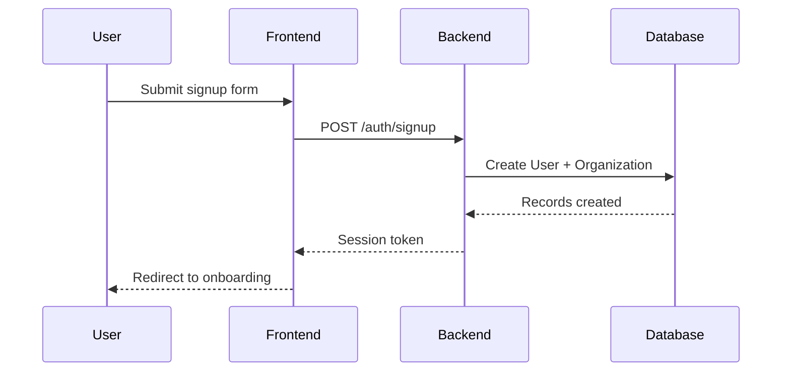

### 42.2 Business Creation

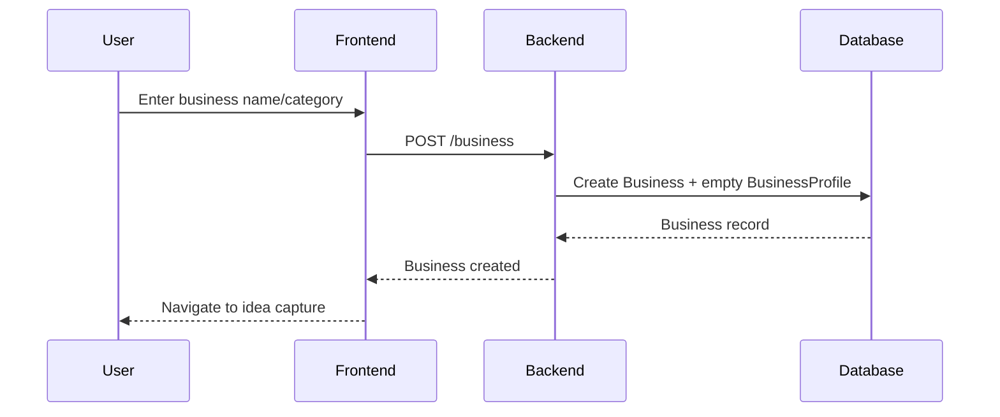

### 42.3 AI Business Analysis

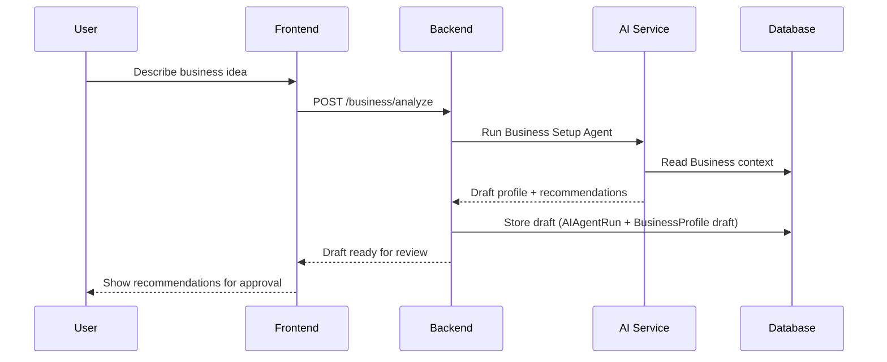

### 42.4 Product Creation

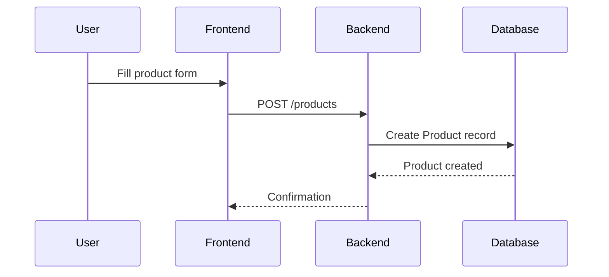

### 42.5 AI Content Generation

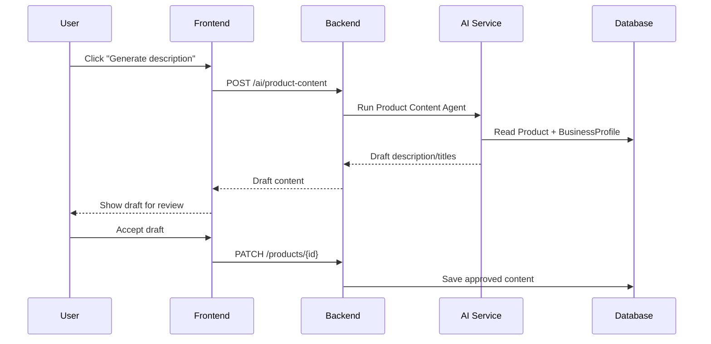

### 42.6 New Order

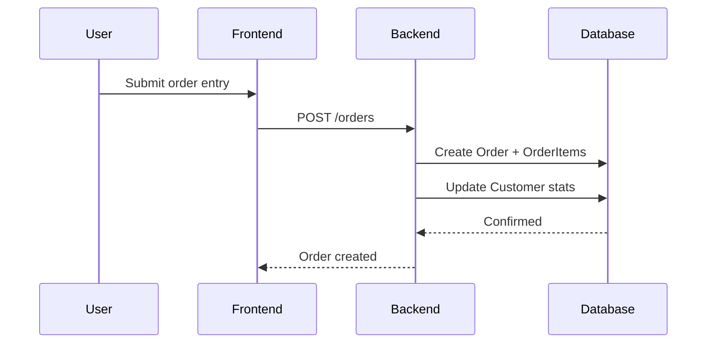

### 42.7 Inventory Update (Phase 6)

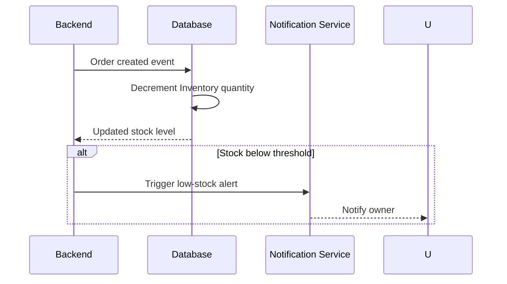

### 42.8 Customer Creation

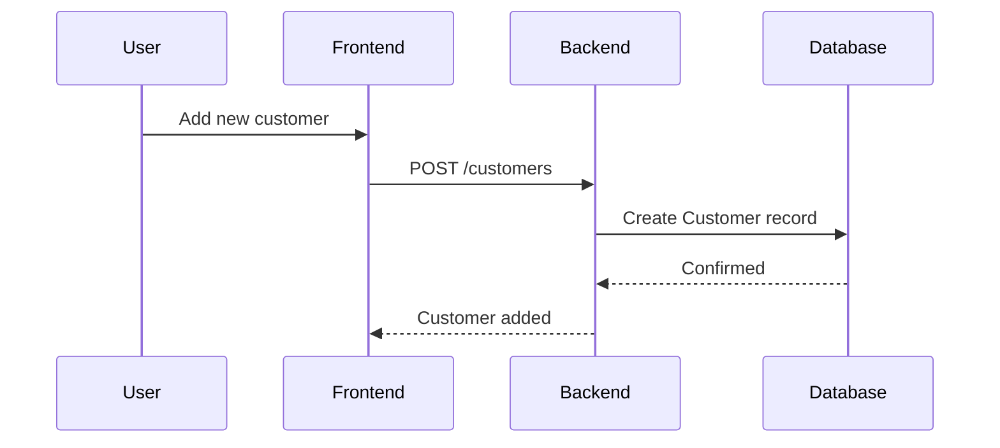

### 42.9 AI Business Query (Assistant)

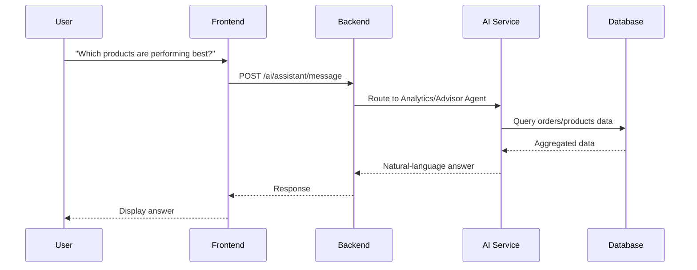

### 42.10 Automation Execution (Phase 8)

```mermaid
sequenceDiagram
    participant EVT as Event Source
    participant Q as Queue
    participant ENG as Workflow Engine
    participant AI as AI Service
    participant DB as Database
    EVT->>Q: Emit event (e.g., low stock)
    Q->>ENG: Deliver event
    ENG->>AI: Invoke relevant agent
    AI-->>ENG: Suggested action
    ENG->>DB: Log AIAgentRun + pending approval
    ENG-->>U: Notify owner for approval
```

### 42.11 Payment (Phase 6+)

```mermaid
sequenceDiagram
    participant U as User
    participant FE as Frontend
    participant BE as Backend
    participant PAY as Payment Gateway
    participant DB as Database
    U->>FE: Confirm payment
    FE->>BE: POST /payments/charge
    BE->>PAY: Create charge
    PAY-->>BE: Charge result
    BE->>DB: Record Transaction
    BE-->>FE: Payment confirmed
```

### 42.12 Notification

```mermaid
sequenceDiagram
    participant BE as Backend
    participant Q as Queue
    participant MAIL as Email Service
    participant U as User
    BE->>Q: Enqueue notification
    Q->>MAIL: Send email/in-app alert
    MAIL-->>U: Notification delivered
```

---

## 43. API Flow

**Standard business data flow:**

```mermaid
flowchart TD
    FE["Frontend"] --> GW["API Gateway"]
    GW --> AUTHN["Authentication"]
    AUTHN --> AUTHZ["Authorization (tenant + role check)"]
    AUTHZ --> SVC["Business Service"]
    SVC --> REPO["Repository Layer"]
    REPO --> PG[("PostgreSQL")]
```

**AI-involved flow:**

```mermaid
flowchart TD
    FE["Frontend"] --> AIAPI["AI API"]
    AIAPI --> ROUTER["Agent Router"]
    ROUTER --> MODELROUTE["Model Router"]
    MODELROUTE --> LLM["LLM Provider"]
    LLM --> TOOLCALL["Tool Calling"]
    TOOLCALL --> BAPI["Business API"]
    BAPI --> DB[("Database")]
```

**Step explanations:**

1. **Authentication** confirms who the caller is.
2. **Authorization** confirms they may act on this specific Business (tenant check) and have the required role/permission.
3. **Business Service** contains the actual logic (validation, side effects).
4. **Repository Layer** is the only code allowed to issue SQL/ORM queries — services never query the database directly, keeping tenant-scoping enforcement centralized.
5. For AI flows, the **Agent Router** decides which specialized agent handles the request; the **Model Router** picks the LLM provider/tier (MVP: a single fixed provider, no real routing logic yet, per Section 30.1); **Tool Calling** is how the agent reaches back into normal Business APIs — an agent never touches the database directly, only through the same service/repository layers as the frontend.

---

## 44. Deployment Architecture

```mermaid
flowchart TB
    U["User"] --> CDN["CDN"]
    CDN --> FE["Frontend (static/SSR)"]
    FE --> LB["Load Balancer"]
    LB --> BE["Backend"]
    BE --> REDIS[("Redis")]
    BE --> PG[("PostgreSQL")]
    BE --> BLOB[("Object Storage")]
    BE --> AIGW["AI Gateway"]
    AIGW --> LLM["LLM Providers"]

    subgraph CICD["CI/CD"]
        GH["GitHub"] --> BUILD["Build/Test"]
        BUILD --> DOCKER["Docker Image"]
        DOCKER --> DEPLOY["Cloud Deployment"]
    end

    DEPLOY --> BE
    DEPLOY --> FE

    subgraph OBS["Observability"]
        MON["Monitoring"]
        LOG["Logging"]
        SEC["Secrets Manager"]
    end

    BE --> MON
    BE --> LOG
    BE --> SEC
```

MVP deployment should stay simple: one frontend deployment, one backend deployment (modular monolith per Section 35), managed Postgres/Redis, a single CI/CD pipeline (GitHub Actions or equivalent), and baseline monitoring/logging — not a multi-region, multi-cluster setup.

---

## 45. Security Architecture

```mermaid
flowchart TD
    U["User"] --> AUTHN["Authentication"]
    AUTHN --> SESSION["JWT / Session"]
    SESSION --> AUTHZ["Authorization"]
    AUTHZ --> TENANT["Tenant Isolation Check"]
    TENANT --> API["API"]
    API --> DB[("Database")]

    API -.enforces.-> RBAC["RBAC"]
    DB -.enforces.-> RLS["Row-Level Security"]
    API -.applies.-> RATE["Rate Limiting"]
    DB -.protected by.-> ENC["Encryption at Rest"]
    API --> AUDIT["Audit Logs"]
    API -.governs.-> AITOOLS["AI Tool Permissions"]
    AITOOLS --> APPROVAL["Human Approval Gate"]
```

Every request passes: Authentication → Session validation → Authorization → Tenant isolation check, before it ever reaches business logic or the database. AI tool calls pass through the same Authorization and Tenant Isolation checks as any other API caller — an agent has no special bypass — and additionally pass through the Approval Gate defined in Section 9.4 for any non-autonomous-tier action.

---

## 46. Visual Requirements Note

All diagrams in this document are provided as Mermaid diagrams, which render directly wherever Mermaid is supported and remain readable as plain text otherwise. No decorative or non-explanatory imagery has been included — every visual above communicates architecture, data flow, user flow, or UI structure directly relevant to building BusinessOS AI.

---

## 47. Final Outcome — What We Will Have

After the full roadmap is completed, BusinessOS AI will provide:

1. Business creation
2. Business onboarding
3. AI business advisor
4. Business dashboard
5. Product/service management
6. Customer management
7. Sales management
8. Order management
9. Inventory
10. Finance
11. Marketing
12. AI content generation
13. AI agents (full roster)
14. Automation
15. Analytics
16. Notifications
17. Team management
18. Integrations
19. Website/storefront
20. Future marketplace

**Core MVP** = items 1–8, 12 (basic), and 13 (two agents only), 15 (basic), 16 (basic) — everything scoped explicitly in Section 19.

**Future Platform** = items 9–11, 14, and the full depth of 13/15/17–20, delivered across Phases 2–10 (Section 20).

---

## 48. CTO Build Recommendation — Milestones

**MILESTONE 0 — Product Foundation**
*Outcome:* Finalized specification (this document), confirmed technical architecture, completed SMART-BUSSINESS repo audit.
Features: none (documentation only). Screens: none. Database: none. APIs: none. AI: none. Tests: none. Definition of Done: this document reviewed and signed off by all stakeholders. Expected User Outcome: n/a. Expected Business Outcome: shared clarity before spend begins.

**MILESTONE 1 — Identity + Business**
*Outcome:* A user can sign up, create an organization and a business, and land in an empty workspace.
Features: signup/login, Business creation. Screens: Landing, Signup, Login, empty Dashboard shell. Database: User, Organization, Business, BusinessProfile (empty). APIs: /auth/*, /business (CRUD). AI: none yet. Tests: auth flow, tenant isolation. Definition of Done: a second business created by a second user cannot see the first business's data. Expected User Outcome: "I have an account and a workspace." Expected Business Outcome: foundation for every later milestone.

**MILESTONE 2 — Business Onboarding + AI**
*Outcome:* A user describes their idea and receives an AI-drafted business profile they can review and approve.
Features: idea capture flow, Business Setup Agent, Advisor Agent v1, Dashboard v1. Screens: Idea capture, AI recommendation review, Dashboard (health cards + recommendations). Database: AIAgentRun, AIConversation, BusinessProfile (populated fields). APIs: /business/analyze, /ai/assistant/message. AI: Business Setup Agent, Advisor Agent (basic). Tests: draft-then-approve flow, approval gating. Definition of Done: idea text in → approved business profile out, end to end. Expected User Outcome: "BusinessOS understood my idea and helped me structure it." Expected Business Outcome: core differentiated value proposition first demonstrated.

**MILESTONE 3 — Products + Services**
*Outcome:* A user creates products/services with AI-generated content.
Features: Product CRUD, Product Content Agent. Screens: Products list, Product create/edit with AI panel. Database: Product, ProductVariant (minimal). APIs: /products, /ai/product-content. AI: Product Content Agent. Tests: content draft/accept flow. Definition of Done: a product can be created, AI-drafted, edited, and published. Expected User Outcome: "I don't have to write my own product descriptions." Expected Business Outcome: second core agent live; retention driver.

**MILESTONE 4 — CRM + Customers**
*Outcome:* A user can track customers and basic order history; first Team Member roles introduced.
Features: Customer CRUD, TeamMember + Role. Screens: Customers list/detail, basic Settings (team). Database: Customer, Lead, TeamMember, Role. APIs: /customers, /team. AI: none new (CRM Agent deferred). Tests: role-based access. Definition of Done: a second team member with a restricted role can log in and see only permitted screens. Expected User Outcome: "I know who my customers are." Expected Business Outcome: groundwork for multi-user businesses.

**MILESTONE 5 — Sales + Orders**
*Outcome:* A user can record and track orders against products and customers.
Features: Order CRUD, order-customer-product linkage. Screens: Orders list/detail, order entry form. Database: Order, OrderItem. APIs: /orders. AI: none new. Tests: order totals, customer stats update. Definition of Done: an order updates customer history and appears in dashboard metrics. Expected User Outcome: "I can see my sales in one place." Expected Business Outcome: MVP is now functionally complete (Section 19).

**MILESTONE 6 — AI Marketing**
*Outcome:* Marketing Agent and Social Media module introduced.
Features: campaign drafting, social scheduling. Screens: Marketing, Campaigns. Database: MarketingCampaign, SocialAccount, SocialPost. APIs: /marketing/*, /social/*. AI: Marketing Agent, Social Media Agent. Tests: draft-review-publish flow, approval gating on publish. Definition of Done: a campaign can be drafted, approved, and scheduled. Expected User Outcome: "AI helps me market, not just describe products." Expected Business Outcome: differentiation vs. pure e-commerce tools sharpens.

**MILESTONE 7 — Inventory**
*Outcome:* Stock tracking and low-stock alerting.
Features: Inventory CRUD, Supplier records, Inventory Agent. Screens: Inventory. Database: Inventory, Supplier. APIs: /inventory, /suppliers. AI: Inventory Agent. Tests: stock decrement on order, threshold alerting. Definition of Done: an order correctly decrements stock and triggers an alert at threshold. Expected User Outcome: "I won't oversell what I don't have." Expected Business Outcome: operational depth for physical-product businesses.

**MILESTONE 8 — Finance**
*Outcome:* Invoicing and basic transaction tracking.
Features: Invoice CRUD, Transaction records, Finance Assistant Agent. Screens: Finance. Database: Invoice, Transaction. APIs: /finance/*. AI: Finance Assistant Agent. Tests: invoice-to-transaction reconciliation. Definition of Done: an invoice can be drafted, sent (approval-gated), and marked paid with a linked transaction. Expected User Outcome: "I have basic financial visibility without separate accounting software." Expected Business Outcome: reduces reliance on external finance tools.

**MILESTONE 9 — Automation**
*Outcome:* Configurable trigger→action automation rules.
Features: Automation rule builder, Automation Agent, event bus/workflow engine. Screens: Automations. Database: Automation. APIs: /automations. AI: Automation Agent. Tests: end-to-end trigger firing, approval gating enforced. Definition of Done: a user-configured rule fires correctly and logs to audit. Expected User Outcome: "Repetitive tasks now happen without me." Expected Business Outcome: time-saved metric (Section 24) becomes measurable.

**MILESTONE 10 — Analytics**
*Outcome:* Cross-module insight generation.
Features: Analytics aggregation, Analytics Agent narratives. Screens: Analytics. Database: none new (derived views). APIs: /analytics/*. AI: Analytics Agent. Tests: metric accuracy vs. raw data. Definition of Done: dashboard and Analytics agree on every number. Expected User Outcome: "I understand *why*, not just *what*." Expected Business Outcome: supports upsell into higher tiers (Section 22).

**MILESTONE 11 — Storefront**
*Outcome:* Public-facing website/store per business.
Features: template selection, branding, public page publishing, customer-originated orders. Screens: Website builder, public Storefront. Database: Website, Storefront. APIs: /website/*, public storefront APIs. AI: none new (reuses Product Content Agent output). Tests: public order correctly creates an Order/Customer in the owner's workspace. Definition of Done: an external customer can complete a purchase that appears correctly inside BusinessOS. Expected User Outcome: "My whole online presence lives in one system." Expected Business Outcome: unlocks the Phase 10 marketplace path.

**MILESTONE 12 — Scale + Advanced AI**
*Outcome:* Growth Advisor Agent, full agent memory/RAG, multi-provider model routing, and marketplace groundwork.
Features: advanced agent roster, memory/RAG infrastructure, model routing, early marketplace discovery. Screens: expanded AI Assistant, marketplace discovery (early). Database: AI_MEMORY, embeddings, marketplace-supporting tables. APIs: expanded /ai/* surface. AI: full roster from Section 9. Tests: cross-agent orchestration, cost/latency benchmarks for model routing. Definition of Done: agents share context appropriately without cross-tenant leakage. Expected User Outcome: "BusinessOS actively helps me grow, not just operate." Expected Business Outcome: platform is ready for Phase 10 marketplace expansion.

---

## 49. Most Important Rule

No coding begins after this document. This Master Product Specification — Parts 1 and 2 together — is the first deliverable. It should leave any reader (founder, engineer, AI coding agent, or investor) able to answer: what we are building, why, who uses it, how they use it, what the user sees, what the AI does, what the backend does, what data is stored, what automations run, what the MVP is, what comes later, how the complete system connects, what the finished product looks like, and exactly what gets built first.

Only after this document is reviewed and approved should Milestone 1 (Section 48) begin.

---

*End of Master Product Specification (Parts 1 & 2). No implementation, coding, or Milestone 1 work has been started, per the stated requirement. This document is intended to be the shared reference for product, engineering, and any AI coding agent involved in building BusinessOS AI.*
